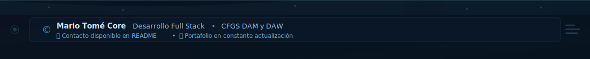

<!-- Banner Superior -->
<p align="center">
  
</p>

<!-- Typing SVG Animado -->
<p align="center">
  
</p>

<!-- Badges y Redes Sociales -->
<p align="center">
  <a href="https://mariotc1.github.io"></a>
  <a href="https://www.linkedin.com/in/mario-tomé-core-114551343/"></a>
  <a href="mailto:mariotomecore@gmail.com"></a>
  <a href="https://github.com/mariotc1"></a>
</p>

<p align="center">
  
</p>

---

## 👨‍💻 Sobre Mí

```python
class DesarrolladorFullStack:
    def __init__(self):
        self.nombre = "Mario Tomé Core"
        self.ubicacion = "Valladolid, España"
        self.educacion = [
            "Técnico Superior DAM",
            "Técnico Superior DAW"
        ]
        self.objetivo = "Prácticas profesionales - Experiencia real"
        self.pasion = "Construir proyectos completos y escalables"
    
    def habilidades_actuales(self):
        return {
            "lenguajes": ["Python", "Java", "JavaScript", "PHP", "Dart", "SQL"],
            "frameworks": ["PyQt5", "Flask", "Spring", "Flutter", "React"],
            "herramientas": ["Git", "Docker", "GitHub Actions", "Android Studio"],
            "base_datos": ["MySQL", "SQLite", "Supabase"],
            "especialidad": "Aplicaciones multiplataforma y web"
        }
    
    def actualmente_aprendiendo(self):
        return ["React avanzado", "Arquitecturas cloud", "DevOps", "Testing automatizado"]

yo = DesarrolladorFullStack()
```

---

## 🛠️ Stack Tecnológico

### Lenguajes de Programación
<p align="left">
  
  
  
  
  
  
  
  
  
  
  
</p>

### Frontend & Mobile
<p align="left">
  
  
  
  
  
  
  
  
  
</p>

### Backend & Databases
<p align="left">
  
  
  
  
  
  
  
  
  
</p>

### Herramientas & DevOps
<p align="left">
  
  
  
  
  
  
  
  
  
  
  
</p>

---

## 📊 Estadísticas de GitHub

<div align="center">
  
</div>

<div align="center">
  
  
</div>

<div align="center">
  
  
</div>

---

## 🔥 Racha de Contribuciones

<p align="center">
  
</p>

---

## 🏆 Logros de GitHub

<p align="center">
  
</p>

---

## 📈 Gráfico de Actividad

<p align="center">
  
</p>

---

## 🐍 Contribuciones Snake

<picture>
  <source media="(prefers-color-scheme: dark)" srcset="https://raw.githubusercontent.com/mariotc1/mariotc1/output/github-contribution-grid-snake-dark.svg">
  <source media="(prefers-color-scheme: light)" srcset="https://raw.githubusercontent.com/mariotc1/mariotc1/output/github-contribution-grid-snake.svg">
  
</picture>

---

## 📌 Actividad Reciente

<!--START_SECTION:activity-->
<!--END_SECTION:activity-->

---

## 🚀 Proyectos Destacados

<div align="center">

### 📱 Aplicaciones Móviles

<table>
  <tr>
    <td width="50%" valign="top">
      <h3 align="center">🍅 PomodoroApp</h3>
      <div align="center">
        <a href="https://github.com/mariotc1/PomodoroApp" target="_blank">
          
        </a>
      </div>
      <br>
      <p align="center">
        
        
        
      </p>
      <p align="center">App móvil de productividad con técnica Pomodoro. Incluye gestión de tareas, temporizador personalizable y estadísticas detalladas de uso.</p>
    </td>
    <td width="50%" valign="top">
      <h3 align="center">🌍 CapitalQuiz</h3>
      <div align="center">
        <a href="https://github.com/mariotc1/CapitalQuiz" target="_blank">
          
        </a>
      </div>
      <br>
      <p align="center">
        
        
        
      </p>
      <p align="center">Juego educativo de geografía con quiz interactivo. Múltiples niveles de dificultad y sistema de puntuación.</p>
    </td>
  </tr>
</table>

### 💻 Aplicaciones de Escritorio

<table>
  <tr>
    <td width="50%" valign="top">
      <h3 align="center">📊 CRM Python</h3>
      <div align="center">
        <a href="https://github.com/mariotc1/CRM_Python" target="_blank">
          
        </a>
      </div>
      <br>
      <p align="center">
        
        
        
      </p>
      <p align="center">Sistema CRM completo con interfaz gráfica. Gestión de clientes, productos, ventas y reportes detallados.</p>
    </td>
    <td width="50%" valign="top">
      <h3 align="center">📦 AppStockDB</h3>
      <div align="center">
        <a href="https://github.com/mariotc1/AppStockDB-" target="_blank">
          
        </a>
      </div>
      <br>
      <p align="center">
        
        
        
      </p>
      <p align="center">Aplicación híbrida de gestión de inventario. Interfaz PyQt5 con backend Flask para control de stock en tiempo real.</p>
    </td>
  </tr>
</table>

### 🌐 Proyectos Web

<table>
  <tr>
    <td width="50%" valign="top">
      <h3 align="center">💼 Portfolio Personal</h3>
      <div align="center">
        <a href="https://mariotc1.github.io" target="_blank">
          
        </a>
        <a href="https://github.com/mariotc1/mariotc1.github.io" target="_blank">
          
        </a>
      </div>
      <br>
      <p align="center">
        
        
        
      </p>
      <p align="center">Portfolio profesional desplegado en GitHub Pages. Diseño responsive y moderno con animaciones.</p>
    </td>
    <td width="50%" valign="top">
      <h3 align="center">🍅 Pomodoro Landing</h3>
      <div align="center">
        <a href="https://github.com/mariotc1/pomodoro-landing" target="_blank">
          
        </a>
      </div>
      <br>
      <p align="center">
        
        
        
      </p>
      <p align="center">Landing page moderna para promocionar PomodoroApp. Diseño minimalista y optimizado.</p>
    </td>
  </tr>
</table>

</div>

---

## 💼 ¿Por qué trabajar conmigo?

<table>
  <tr>
    <td align="center" width="25%">
      
      <br><strong>Código Limpio</strong>
      <br><sub>Escribo código mantenible y escalable siguiendo las mejores prácticas</sub>
    </td>
    <td align="center" width="25%">
      
      <br><strong>Aprendizaje Continuo</strong>
      <br><sub>Siempre explorando nuevas tecnologías y metodologías</sub>
    </td>
    <td align="center" width="25%">
      
      <br><strong>Trabajo en Equipo</strong>
      <br><sub>Colaborativo, comunicativo y orientado a resultados</sub>
    </td>
    <td align="center" width="25%">
      
      <br><strong>Proyectos Completos</strong>
      <br><sub>De la idea al deployment, entrego soluciones funcionales</sub>
    </td>
  </tr>
</table>

---

## 📫 Contacto

<p align="center">
  💼 <strong>Buscando prácticas profesionales</strong> para ganar experiencia real en desarrollo de software
</p>

<p align="center">
  📧 Email: <a href="mailto:mariotomecore@gmail.com">mariotomecore@gmail.com</a><br>
  🔗 LinkedIn: <a href="https://www.linkedin.com/in/mario-tomé-core-114551343/">Mario Tomé Core</a><br>
  🌐 Portfolio: <a href="https://mariotc1.github.io">mariotc1.github.io</a><br>
  💻 GitHub: <a href="https://github.com/mariotc1">@mariotc1</a>
</p>

---

<p align="center">
  
</p>

<p align="center">
  <i>⭐️ Si te gusta mi trabajo, no dudes en dar una estrella a mis proyectos ⭐️</i>
</p>